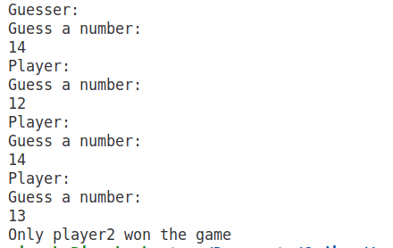

# Guessing Game

A console based Number guessing game.

## Brief Description: 

- Designed and Developed a **Console-Based Number Guessing Game**

- Leveraged **core Java** concepts, including **nested if-else statements**, **operators**, and programming logic, to create an interactive and engaging console game.

## Game:

1. First a guesser guesses a number.
2. Then each player gets a chance to tell their guess.
3. Then the final result is displayed on the console.

### Layout

